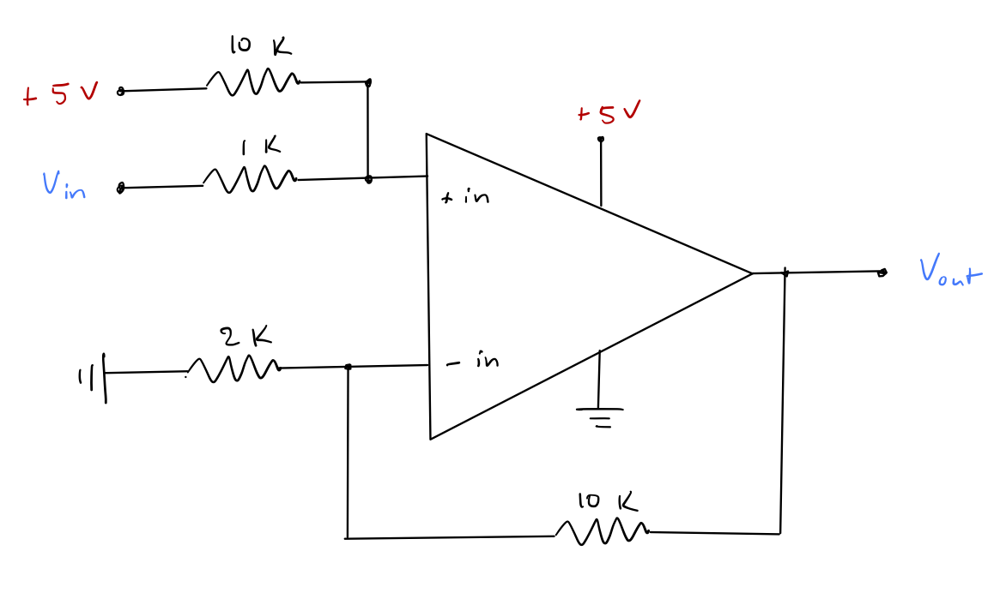
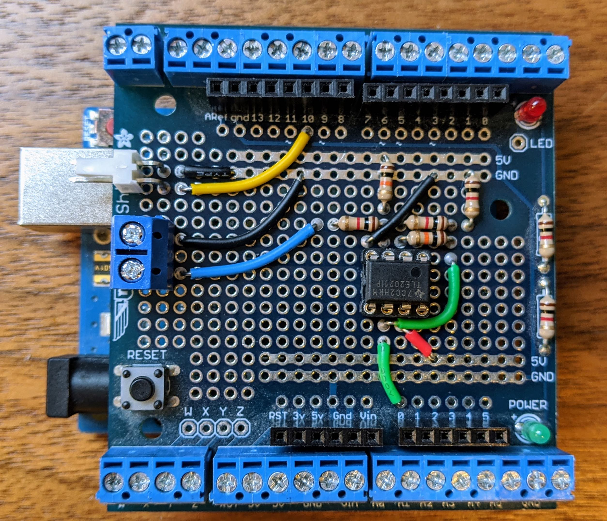
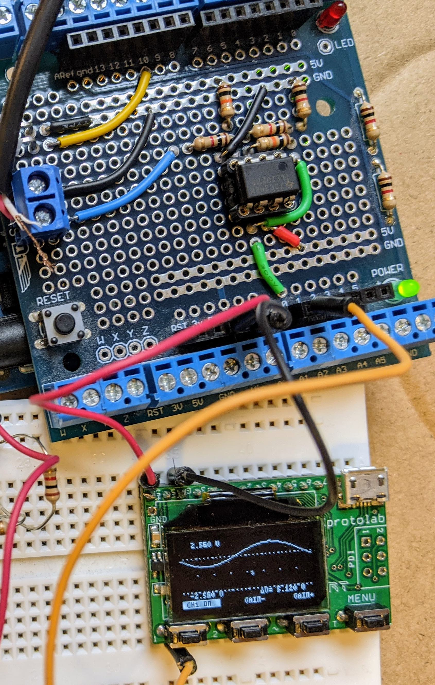

# FFT-based Audio Visualization

Developed by Jonathan MacArt 2012-2020

Dependencies:

- [FastLED](https://github.com/FastLED/FastLED)
- [fix_fft](https://www.arduino.cc/reference/en/libraries/fix_fft/)

Tested using an Arduino Uno and individually addressable WS2811 LEDs, but other combinations are likely possible. In-use examples:

- https://www.youtube.com/watch?v=B0CPVkpbbqc
- https://www.youtube.com/watch?v=mZiZcwaqly0

## Summary

This provides a ready-to-use Arduino program for audio visualization via the fast Fourier transform (FFT). The signal is sent to individually addressable LEDs. Key features are:

- The program reads pin A0 for an audio signal, which it expects to be conditioned to 2.5 V mean with +/- 2.5 V peak-to-peak (assuming you use a 5 V microcontroller). I describe my signal-conditioning circuit below.

- The `fix_fft` library does most of the heavy lifting; it computes a fixed-point-precision, in-place FFT with significantly higher performance than a floating-point FFT.

- The program computes an exponential moving average of the FFT bins and sends this to user-defined LED bins using `FastLED`.

- The program has two modes: active, FFT-based visualization, which it enters when an input signal is detected, and "standby" pre-programmed visualizations, to which it reverts otherwise. My principal use has been Christmas tree lighting, so the included visualizations are mostly along these lines. Others are certainly possible; just use the included ones as templates.

## Signal conditioning

Your line-level audio signal most likely has a mean of 0 V; we need to shift this to the center of your ADC's range (e.g., 2.5 V for 5-volt devices). Unless you're using a 1.6-volt microcontroller, we also likely need to apply some gain. My input (line-level) audio signal is about 0.6 V peak-to-peak.

The following circuit applies a gain of 6x and shifts the signal to approximately 2.5 V mean. The line-level audio signal goes to `Vin`. `Vout` goes to your ADC; I use pin A0. 

Here's the built-up circuit on an [Adafruit screw shield](https://www.adafruit.com/product/196). I use a Texas Instruments TLE2021 Excalibur Op-Amp, but others will likely work too. The blue wire is `Vin` in the diagram above. Green provides the conditioned signal to A0. Yellow (digital pin 10) sends the digital signal to the addressable LEDs.

And a final shot showing the conditioned output of a 1 kHz sine wave at about +2.5 V mean.

